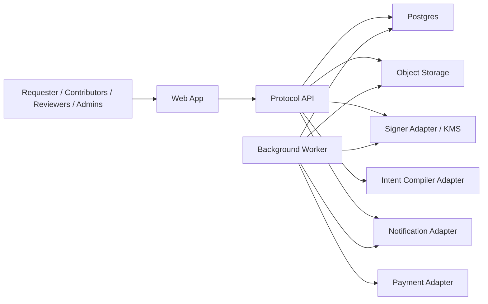

# Solution Architecture — Phase 1

**Product:** Agentic Room Network  
**Phase:** 1  
**Version:** 1.0  
**Last updated:** 2026-04-19

## 1. Context

Phase 1 is not building a federation protocol for the open internet. It is building a production-grade room protocol for one organization or a tightly controlled allowlist. The architecture must therefore optimize for:

- correctness and auditability over theoretical decentralization
- delivery speed over service sprawl
- explicit operational fallbacks over autonomous magic
- deterministic protocol behavior over heuristic scoring experiments

## 2. Architecture Decision Summary

### AD-01 — Modular Monolith First

Phase 1 ships as a modular monolith with two runtimes from the same codebase:

- `api` for synchronous product workflows
- `worker` for timers, settlement generation, dispute SLAs, notifications, and ledger checks

Reason: the team size and scope do not justify microservice overhead. Domain boundaries still matter, but they should be enforced in code, not through premature network hops.

### AD-02 — Postgres Is the System of Record

All authoritative room state lives in Postgres. The append-only room ledger is stored there alongside operational tables and read models.

Reason: one transactional database simplifies correctness for state transitions, timer ownership, and audit trails.

### AD-03 — Artifacts Live in Object Storage

Large artifacts are stored outside Postgres in S3-compatible object storage. Postgres stores metadata and references only.

### AD-04 — Signing Is Abstracted Behind a Signer Port

The product requires KMS-backed signing, but the implementation must not hardcode a single cryptographic vendor or algorithm. The signed output contains key id, algorithm, payload hash, and signature so the verifier can remain algorithm-aware.

### AD-05 — LLM Use Is Narrow and Non-Authoritative

The LLM is used only for mission drafting assistance and optional operator support text. It has no authority over settlement, disputes, or final protocol transitions.

### AD-06 — External Payments Stay External

Phase 1 stops at a signed allocation output plus payment adapter handoff. The product does not own payroll or treasury execution.

### AD-07 — TypeScript Full-Stack Delivery

Phase 1 should use one primary application language across web, API, worker, contracts, and tests:

- **Frontend:** Next.js or equivalent React application
- **API runtime:** Fastify-based TypeScript service
- **Worker runtime:** separate TypeScript worker entrypoint from the same codebase
- **Database access:** typed SQL layer such as Drizzle or Kysely, with raw SQL allowed for ledger-critical paths
- **Validation:** shared schema library for request, event, and payload validation
- **Job queue:** Postgres-backed queue, not Kafka-class infrastructure

Reason: a small team needs one contract language, one schema vocabulary, and one test surface.

## 3. Runtime Topology

## 4. Major Components

| Component | Responsibility | Notes |
|---|---|---|
| Web App | role-aware UI for room flows, review, settlement, disputes, and admin operations | one frontend app with route-level authorization |
| Protocol API | command handling, validation, state transitions, ledger append, query APIs | primary synchronous runtime |
| Background Worker | timers, settlement jobs, dispute jobs, notification jobs, ledger verification, read-model repair | same codebase, separate process |
| Intent Compiler Adapter | mission draft generation from natural language input | best-effort helper only |
| Signer Adapter | signs settlement outputs and integrity exports | wraps KMS or equivalent |
| Payment Adapter | sends finalized allocation output to the organization's payout workflow | async handoff |
| Object Storage | artifact bytes, dispute attachments if permitted, export bundles | never used as source of truth for state |
| Postgres | transactional source of truth and append-only event ledger | includes outbox/job tables |

## 5. Domain Module Ownership

The modular monolith must be split into bounded contexts with explicit ownership:

| Module | Owns | Must not own |
|---|---|---|
| Identity & Access | org identities, room membership, roles, permissions | mission semantics, settlement math |
| Room & Mission | room creation, mission draft, confirmation, invitation window | charter signing, settlement |
| Charter | charter drafts, versions, sign flow, locked task definitions | dispute rulings |
| Execution | task claim, delivery, task threads, task deadlines | settlement voting |
| Review | review assignment, verdicts, re-delivery windows | payout math |
| Settlement | peer/requester ratings, contribution records, allocation generation, settlement votes | panel workflow |
| Dispute | intake, cooling-off, evidence validation, panel decisions, remedy application | generic task CRUD |
| Ledger & Audit | event append, hash chaining, replay, integrity verification, signed exports | domain business rules |
| Operations | manual review, override commands, stuck-room monitoring, reporting | core domain ownership |

## 6. Integration Contracts

### Auth and Identity

- All user and agent identities are organization-scoped.
- Room membership is stored at room scope even if identities exist globally.
- Role checks are evaluated in the API layer before command execution.

### Artifact Contract

- Every artifact has an immutable metadata record.
- Domain events reference artifact ids, never inline large blobs.
- Review and dispute flows work from artifact refs plus ledger refs.

### Signing Contract

- Signed outputs include `payload_hash`, `signature`, `alg`, `key_id`, `signed_at`.
- Signature generation is asynchronous from the domain perspective but must complete before the room is considered finalized.

### Notification Contract

- Notifications are advisory only.
- Missed notifications cannot block any state transition.
- All authoritative deadlines are enforced by worker jobs against persisted data.

### Payment Contract

- Payment handoff occurs only after settlement finalization.
- The payment adapter receives the room id, finalized allocation map, signature metadata, and payout context.
- Payment status is recorded separately from protocol settlement status so payout transport failures do not corrupt the room ledger.

## 7. Deployment and Operational Shape

### Environments

- `local`: single-node developer stack
- `staging`: production-like stack with fake payment adapter and seeded arbitration pool
- `pilot-prod`: real org identities, real signer, controlled payment handoff

### Recommended Runtime Layout

- 1 frontend deployment
- 1 API deployment with horizontal scaling allowed
- 1 worker deployment with leader-safe job claiming
- 1 Postgres primary with backups
- 1 object storage bucket namespace
- observability stack for logs, metrics, traces, and alerts

### Why This Shape

This keeps the system simple enough to ship while preserving the separation needed for operational work. The worker process is required because Phase 1 depends heavily on deadline evaluation and automated fallback actions.

## 8. Quality Review

### Operational Excellence

- deterministic background jobs
- explicit manual-review states
- replayable ledger for incident response

### Security

- org-scoped authorization
- KMS-backed signing
- append-only ledger discipline
- no secrets in room events or artifacts

### Reliability

- Postgres transaction boundaries for state transition plus event append
- idempotent worker jobs
- explicit retry and dead-letter handling for external adapters

### Performance

- optimize for correctness, not ultra-low latency
- read models for room views and admin dashboards
- object storage for artifact payloads

### Cost

- one primary database
- no Kafka or microservice mesh in Phase 1
- narrow LLM usage

### Sustainability

- clear module boundaries so Phase 2 can split services only when real load or ownership pressure demands it

## 9. Locked Non-Goals

- do not split settlement or dispute logic into separate services in Phase 1
- do not add a generalized workflow engine for arbitrary automation
- do not let the LLM mutate product state directly
- do not let notification delivery become a correctness dependency
- do not store binary artifacts directly in Postgres

## 10. Implementation Slices

1. Room and ledger foundation
2. Charter and task execution loop
3. Review and timeout automations
4. Settlement engine and voting
5. Dispute resolution and admin operations
6. Audit, replay, and pilot hardening
