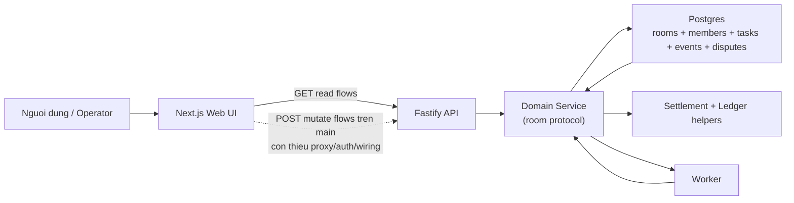
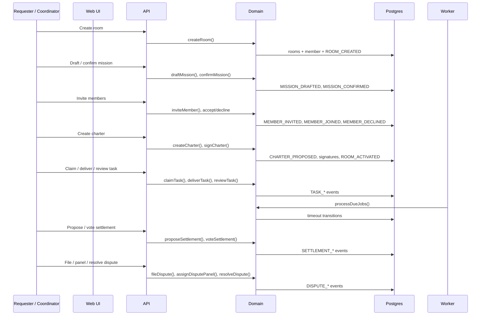

# Agentic Room Hien Tai: Backend Da Di Den Dau, Frontend Da Di Den Dau?

Tinh den ngay 21/04/2026, cach de hieu nhat ve `Agentic Room` la:

- `Backend` la dong co va bo luat cua phong hop tac.
- `Frontend` la bang dieu khien de con nguoi nhin va bam nut.

Neu nhin vao `main` hien tai, dong co da chay duoc phan lon vong doi Phase 1. Nhung bang dieu khien van dang o trang thai "co nhieu man hinh, nhieu nut bam, nhung chua noi day xong".

Noi ngan gon:

- `BE` da cover duoc da so use case cot loi o muc protocol va state machine.
- `FE` da co nhieu UI surface, nhung chua dat muc end-to-end hoat dong on dinh tren `main`.
- Su that hien tai gan voi mo ta trong `docs/phase1/06-current-codebase-baseline.md`: web van nen duoc xem la mot shell quan sat/van hanh hon la mot app da dong bo hoan chinh voi API.

Can cu doc code:

- `packages/domain/src/service.ts`
- `packages/domain/src/replay.ts`
- `apps/api/src/index.ts`
- `apps/web/src/app/page.tsx`
- `apps/web/src/app/rooms/new/page.tsx`
- `apps/web/src/app/rooms/[roomId]/page.tsx`
- `apps/web/src/app/rooms/[roomId]/room-detail-client.tsx`
- `apps/web/src/app/admin/admin-dashboard-client.tsx`
- `docs/phase1/02-user-stories.md`
- `docs/reviews/2026-04-19-codebase-review.md`

## Easy View

Hay tuong tuong `Agentic Room` nhu mot nha may co hai phan.

- `Backend` la day chuyen san xuat va bo phan giam sat quy tac.
- `Frontend` la man hinh dieu khien ngoai san.

O `main` hien tai, day chuyen ben trong da co kha nhieu may:

- tao room
- draft va confirm mission
- moi thanh vien
- tao charter va ky charter
- claim, unclaim, deliver, review task
- tinh settlement, vote settlement
- file dispute, assign panel, resolve dispute
- replay ledger, verify hash chain
- worker xu ly mot so timeout

Tuc la neu hoi: "he thong co bo may nghiep vu chua?" thi cau tra loi la "co, kha nhieu roi".

Nhung neu hoi: "toi co the vao web hien tai, bam het cac use case Phase 1 tu dau den cuoi tren `main` khong?" thi cau tra loi la "chua".

Ly do la frontend hien tai gap 4 van de lon:

1. `mutateJson()` goi vao `/api-proxy`, nhung trong repo hien tai khong co proxy route hay rewrite nao cho duong nay.
2. Browser mutation khong tu gan `x-api-key`, trong khi API yeu cau header nay cho cac lenh POST.
3. `RoomDetailPage` dang ky vong mot object room phang, nhung API tra ve snapshot long nhau (`room`, `mission`, `members`, `tasks`, `settlement`, `disputes`, ...).
4. Mot so nut FE goi sai endpoint hoac sai payload so voi API that.

Vi vay, o muc "FE use case", ta phai tach ro:

- `co man hinh`
- va `thuc su chay end-to-end`

Hai viec nay tren `main` khong giong nhau.

## System Picture

Doc theo so do nay:

- `Backend` la khoi `API + Domain + Worker + DB`.
- `Frontend` dang doc duoc mot so du lieu qua `GET`.
- Nhung luong `POST` tu frontend tren `main` van co nhieu day noi chua khop.

## Main Flow

Dieu quan trong nhat cua sequence nay la:

- sequence backend da ton tai kha day du
- sequence frontend tren `main` chua noi duoc tron ven vao sequence do

## Use-Case Coverage

Quy uoc:

- `Done`: da co va noi kha dung voi use case
- `Partial`: da co cot song, nhung van con lech rule hoac thieu mot doan quan trong
- `Shell`: FE co man hinh/nut, nhung tren `main` chua the xem la flow end-to-end da chay
- `Missing`: gan nhu chua co phan FE nghia vu

| Story | Y nghia ngan | BE | FE |
|---|---|---|---|
| `AR-01` | Draft va confirm mission | `Done` | `Shell` |
| `AR-02` | Invite / accept / decline member | `Done` | `Shell` |
| `AR-03` | Charter rounds + sign/decline | `Partial` | `Shell` |
| `AR-04` | Claim / unclaim task | `Done` | `Shell` |
| `AR-05` | Deliver artifact | `Done` | `Shell` |
| `AR-06` | Review / reject / re-deliver | `Partial` | `Shell` |
| `AR-07` | Automatic timeout handling | `Partial` | `Partial` |
| `AR-08` | Ratings + settlement proposal | `Partial` | `Missing` |
| `AR-09` | Vote and finalize settlement | `Partial` | `Shell` |
| `AR-10` | File dispute | `Done` | `Shell` |
| `AR-11` | Assign panel / resolve dispute | `Partial` | `Shell` |
| `AR-12` | Monitor stuck rooms / manual override | `Partial` | `Partial` |
| `AR-13` | Replay and verify ledger | `Partial` | `Partial` |

### Tai sao backend duoc danh gia cao hon frontend?

Vi backend co route va service that cho gan nhu toan bo vong doi phong:

- `apps/api/src/index.ts` expose day du room, task, settlement, dispute, admin routes
- `packages/domain/src/service.ts` da co `createRoom`, `draftMission`, `confirmMission`, `inviteMember`, `createCharter`, `claimTask`, `unclaimTask`, `deliverTask`, `reviewTask`, `recordPeerRating`, `recordRequesterRating`, `proposeSettlement`, `voteSettlement`, `fileDispute`, `assignDisputePanel`, `resolveDispute`, `overrideRoomStatus`, `processDueJobs`, `verifyRoomsIntegrity`

Noi cach khac: bo may nghiep vu da co.

### Tai sao frontend chi duoc danh gia la shell o nhieu cho?

Vi nhieu use case FE tren `main` gap mot hoac nhieu loi wiring sau:

- `apps/web/src/lib/api.ts` goi mutation qua `/api-proxy`, nhung repo khong co route hay rewrite cho duong nay
- helper mutation khong tu them `x-api-key`
- `apps/web/src/app/rooms/[roomId]/page.tsx` doc `RoomSnapshot` phang, nhung `packages/domain/src/service.ts` tra snapshot dang long
- `apps/web/src/app/rooms/[roomId]/room-detail-client.tsx` goi sai mot so endpoint:
  - task review dang goi `/tasks/:id/accept` va `/tasks/:id/reject`, trong khi API that la `/tasks/:taskId/review`
  - settlement vote dang goi `/settlement/vote`, trong khi API that la `/settlement/votes`
- `apps/web/src/app/admin/admin-dashboard-client.tsx` co them mismatch:
  - replay dang goi `POST` trong khi API la `GET`
  - assign panel gui `panelIds`, trong khi API cast theo `panelists`
  - integrity UI ky vong `{ valid, chainLength }`, trong khi API tra `{ results: [...] }`

Nen neu chi nhin UI, ta rat de nghi rang FE da "xong kha nhieu". Nhung neu nhin den day noi vao API, nhieu flow van chua dat muc "dap ung use case FE".

## Technical Terms

- `Domain service`: lop chua quy tac nghiep vu that. Day la noi quyet dinh room duoc di tiep, fail, dispute, hay settle.
- `State machine`: cach phong di qua cac trang thai `FORMING -> PENDING_CHARTER -> ACTIVE -> IN_REVIEW -> IN_SETTLEMENT -> SETTLED/FAILED/DISPUTED`.
- `Worker timeout`: tac vu nen tu dong day room di tiep khi con nguoi khong phan hoi dung han.
- `Projection / replay`: dung event ledger de xay lai trang thai room thay vi tin vao read model mutable.
- `Frontend shell`: UI da co man hinh va interaction co ban, nhung wiring den API chua du de xem la flow production-like.

## What This Means in Practice

Neu can mot cau ket luan ngan, dung cau nay:

> `Agentic Room` tren `main` hien tai da co backend cua mot giao thuc hop tac da dang hinh, nhung frontend van chua dong bo den muc co the xac nhan "FE da dap ung use case" cho da so Phase 1 story.

Y nghia thuc te:

- Neu muc tieu la `kiem tra protocol/backend`, du an da co rat nhieu chat lieu that de tiep tuc.
- Neu muc tieu la `QA full Phase 1 qua web tren main`, thi chua nen xem nhanh nay la da san sang.
- Neu muc tieu la `merge FE readiness`, viec uu tien cao nhat khong phai la them man hinh moi, ma la sua wiring:
  - snapshot normalization
  - proxy/auth cho browser mutations
  - endpoint/payload alignment
  - bo sung ratings UI
- Neu muc tieu la `lam dung nghiep vu Phase 1`, backend cung van con mot so khoang trong can xu ly:
  - review/rating authorization chua chat
  - settlement timeout/manual-review fallback chua du
  - execution deadline van fail room thay vi force settlement
  - replay/dispute projection van co cho lech

Ket luan dung nhat cho hien tai la:

- `BE`: da vuot qua muc prototype thuan tuy UI
- `FE`: da vuot qua muc mockup, nhung chua vuot qua muc shell
- `Tong the du an`: backend dang di truoc frontend mot quang kha ro
